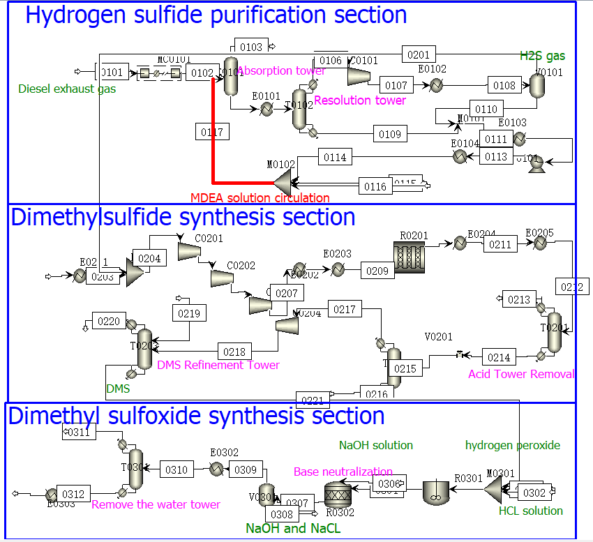
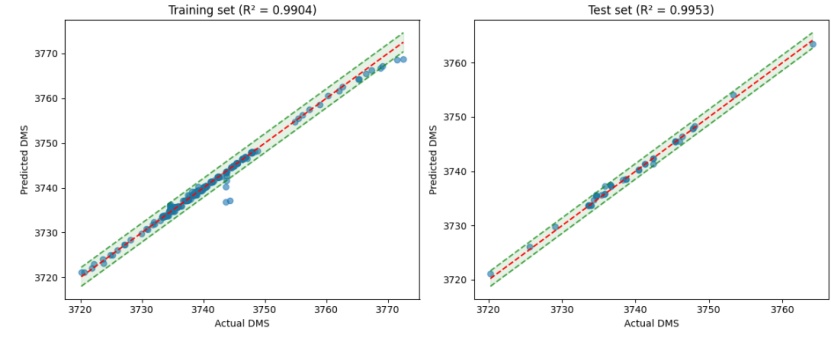

  <h1 align="center">Deep-DMS-Reactor</h1>

  
Yuze Hao, Kai Hou, Xiang Li, Rui-Rui Shi, Lan Duo and Changyan Li

  
College of Chemistry and Chemical Engineering, Inner Mongolia University, Hohhot 010021, China.

  
celicy(at)imu(dot)edu(dot)com

  
Interpretability Deep learning model for optimizing a tubular plug flow reactor in the methanol-hydrogen sulfide to DMS process.

---

# Table of contents

- [Introduction](#Introduction)
- [Reaction Process Construction](#Reaction-Process-Construction)
- [Automated Simulation](#Automated-Simulation)
- [Benchmark](#Benchmark)
- [Deep Leaning Model Training](#Deep-Leaning-Model-Training)
- [Model Interpretability](#Model-Interpretability)
- [Model Inference](#Model-Inference)
- [Reactor Optimization result](#Reactor-Optimization-result)
- [Citation](#Citation)

# Introduction

To address the issues in the traditional parameter optimization of tubular fixed-bed reactors for dimethyl sulfide (DMS) synthesis—including the difficulty in quantifying multi-parameter interactions, the "black-box" nature of model predictions, and the high cost of experiments/simulations—an explainable deep learning model is adopted to achieve global optimization of the reactor's key operating parameters, aiming to maximize the DMS mass flow rate and quantify the influence weight of each parameter on reaction performance.

Reaction Process

    <b><a href="#Table-of-contents">↥ back to top</a></b>

# Reaction Process Construction

We use ASPEN PLUS V12 software to construct Chemical Engineering Process.

# Automated Simulation

For Automated Simulation, we build [pyaspenplus](https://github.com/YuzeHao2023/pyaspenplus) to accelating simulation.

# Benchmark

We use pyaspenplus to automation simulated 482 results as a benchmark, labeling as Mass flow rate of DMS in the outlet stream.

# Deep Leaning Model Training

We have trained about 11 Machine Learning Model and select TabPFN Model to Interpretable data.

Model reslts is listed below:

| Model               | R-Square Value  | RMSE Value                   |
|---------------------|-----------------|------------------------------|
| TabPFN Transformer  | 0.9249          | 1.793                        |
| Random Forest       | 0.9200          | 2.135                        |
| KNN                 | 0.9070          | 2.303                        |
| GradientBoosting    | 0.8930          | 2.477                        |
| GBM                 | 0.8840          | 2.577                        |
| ElasticNet          | 0.8560          | 2.867                        |
| PLSRegression       | 0.8490          | 2.938                        |
| SVM                 | 0.8300          | 3.177                        |
| Decision Tree       | 0.8150          | 3.247                        |
| Linear Regression   | 0.7680          | 3.713                        |
| Neural Network      | -3784.3676      | 3740.327                     |

TabPFN Training figure

# Model Interpretability

# Model Inference

# Reactor Optimization result

# Citation
